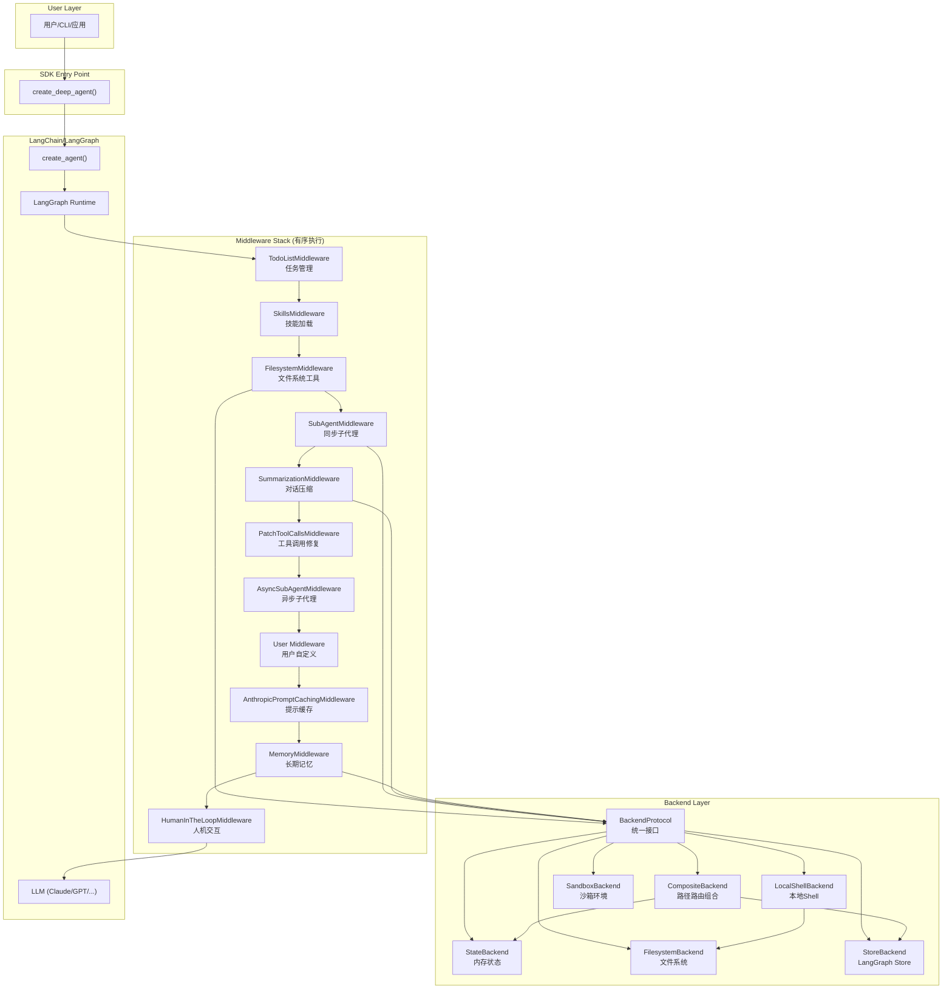
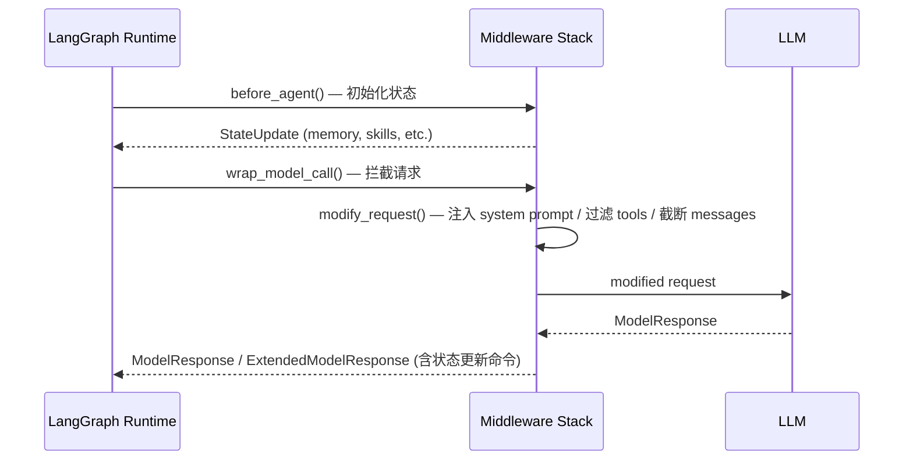
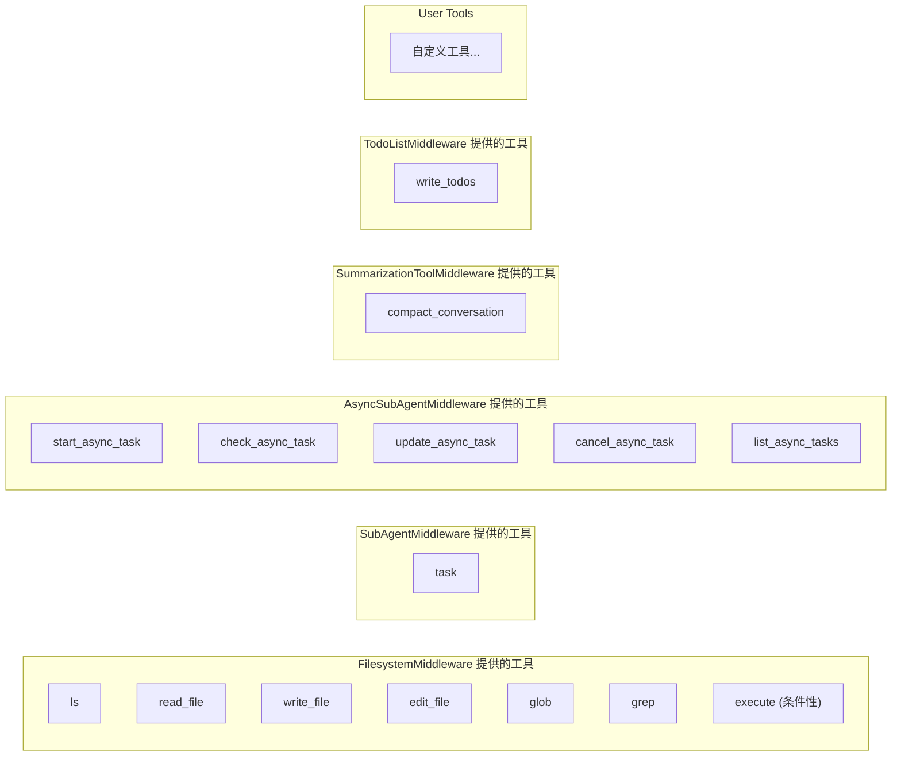

# Deep Agents 总体架构分析

## 1. 项目定位

Deep Agents 是一个基于 LangChain/LangGraph 的 Python SDK，用于构建具备文件系统操作、子代理调度、对话摘要、记忆管理、技能加载等能力的高级 AI Agent。它采用**中间件（Middleware）架构**，将各种能力以可插拔的方式注入到 Agent 的 LLM 调用链中。

## 2. 仓库结构

```
deepagents/
├── libs/
│   ├── deepagents/          # 核心 SDK
│   │   ├── deepagents/
│   │   │   ├── __init__.py       # 公共 API 导出
│   │   │   ├── graph.py          # create_deep_agent 入口，图组装
│   │   │   ├── _models.py        # 模型解析（字符串 → BaseChatModel）
│   │   │   ├── middleware/       # 中间件层（核心）
│   │   │   │   ├── filesystem.py       # 文件系统工具中间件
│   │   │   │   ├── subagents.py        # 同步子代理中间件
│   │   │   │   ├── async_subagents.py  # 异步子代理中间件
│   │   │   │   ├── summarization.py    # 对话摘要/压缩中间件
│   │   │   │   ├── memory.py           # 长期记忆中间件
│   │   │   │   ├── skills.py           # 技能加载中间件
│   │   │   │   ├── patch_tool_calls.py # 工具调用修复中间件
│   │   │   │   └── _utils.py           # 辅助工具
│   │   │   └── backends/         # 存储后端层
│   │   │       ├── protocol.py        # BackendProtocol 定义
│   │   │       ├── state.py           # 状态后端（内存/临时）
│   │   │       ├── filesystem.py      # 文件系统后端
│   │   │       ├── composite.py       # 组合后端（路径路由）
│   │   │       ├── store.py           # LangGraph Store 后端（持久化）
│   │   │       ├── sandbox.py         # 沙箱基类
│   │   │       ├── local_shell.py     # 本地 Shell 后端
│   │   │       └── langsmith.py       # LangSmith 沙箱后端
│   ├── cli/                 # CLI 工具（Textual TUI）
│   ├── acp/                 # Agent Context Protocol 支持
│   ├── evals/               # 评估套件
│   └── partners/            # 第三方集成（Daytona 等）
├── examples/                # 示例项目
└── docs/                    # 文档
```

## 3. 核心架构图



## 4. 中间件执行机制

中间件通过 `AgentMiddleware` 基类实现，核心钩子方法：

```python
class AgentMiddleware:
    state_schema: type[AgentState]      # 定义中间件所需的 State 结构

    def before_agent(state, runtime, config) -> StateUpdate | None
    def wrap_model_call(request, handler) -> ModelResponse
    def after_model_call(response) -> ExtendedModelResponse | None
```

**执行流程：**



## 5. 状态模型

每个中间件通过 `state_schema` 扩展全局 Agent 状态，使用 `PrivateStateAttr` 标记私有字段（不向父代理传播）：

| 中间件 | 状态字段 | 类型 | 说明 |
|--------|---------|------|------|
| FilesystemMiddleware | `files` | `dict[str, FileData]` | 文件系统内容 |
| SummarizationMiddleware | `_summarization_event` | `SummarizationEvent` | 最近一次摘要事件 |
| SkillsMiddleware | `skills_metadata` | `list[SkillMetadata]` | 加载的技能元数据 |
| MemoryMiddleware | `memory_contents` | `dict[str, str]` | AGENTS.md 内容 |
| AsyncSubAgentMiddleware | `async_tasks` | `dict[str, AsyncTask]` | 异步子代理任务追踪 |

## 6. 工具体系



## 7. 设计模式总结

| 模式 | 应用场景 |
|------|---------|
| **中间件链** | 所有核心能力通过有序中间件栈注入 |
| **策略模式** | Backend 抽象，不同存储后端实现统一接口 |
| **组合模式** | CompositeBackend 按路径前缀路由到不同后端 |
| **工厂模式** | `create_deep_agent()` / `create_summarization_middleware()` |
| **渐进式披露** | Skills 系统先展示摘要，按需加载完整内容 |
| **命令模式** | 子代理和异步任务通过 `Command` 对象更新状态 |
| **观察者/拦截器** | `wrap_model_call()` 在 LLM 调用前后拦截和修改请求 |
