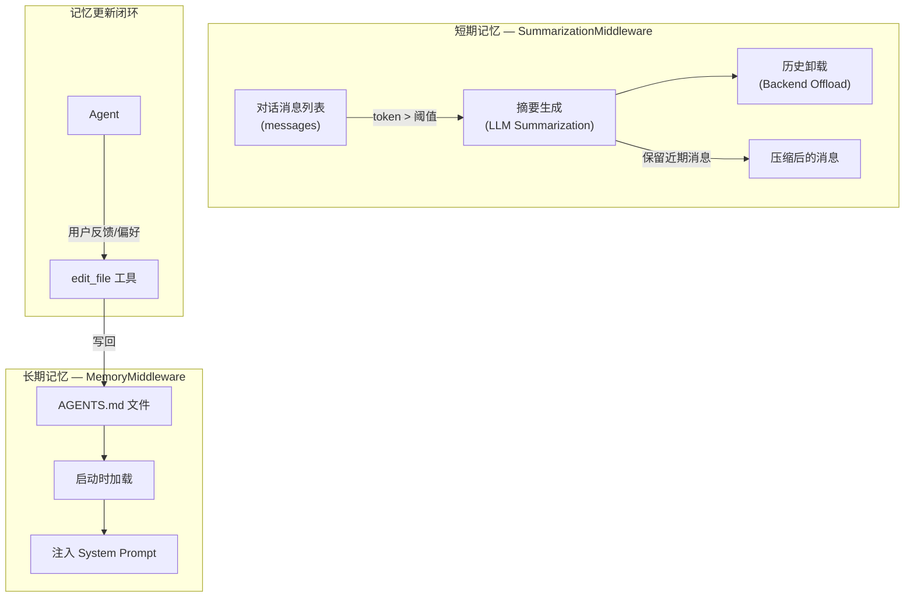
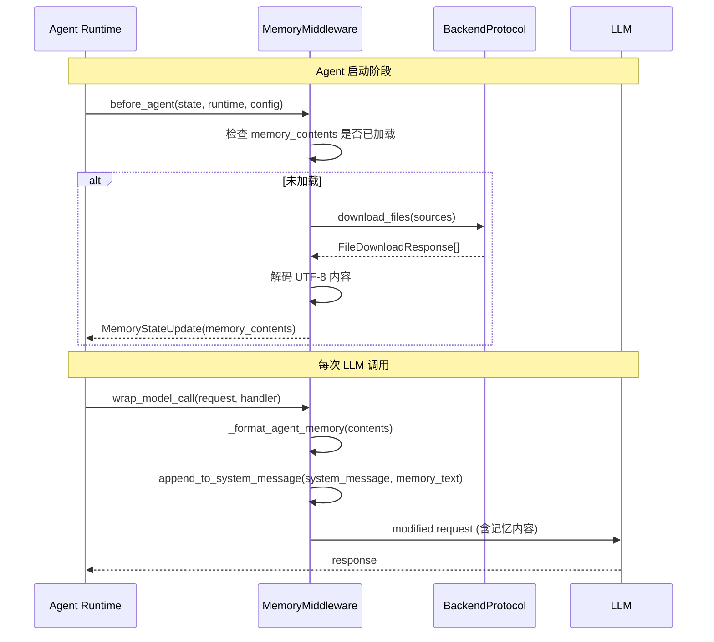
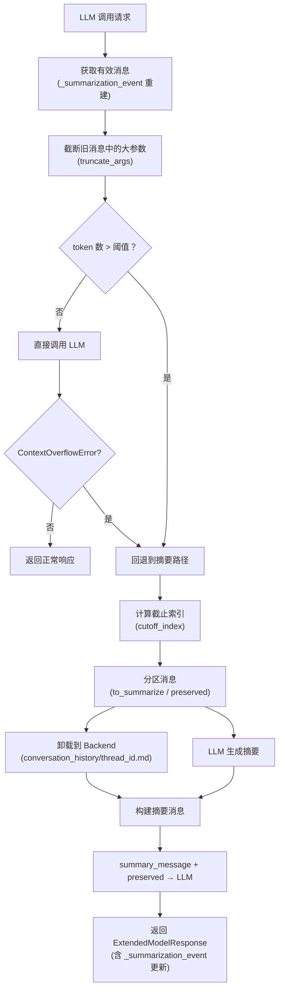
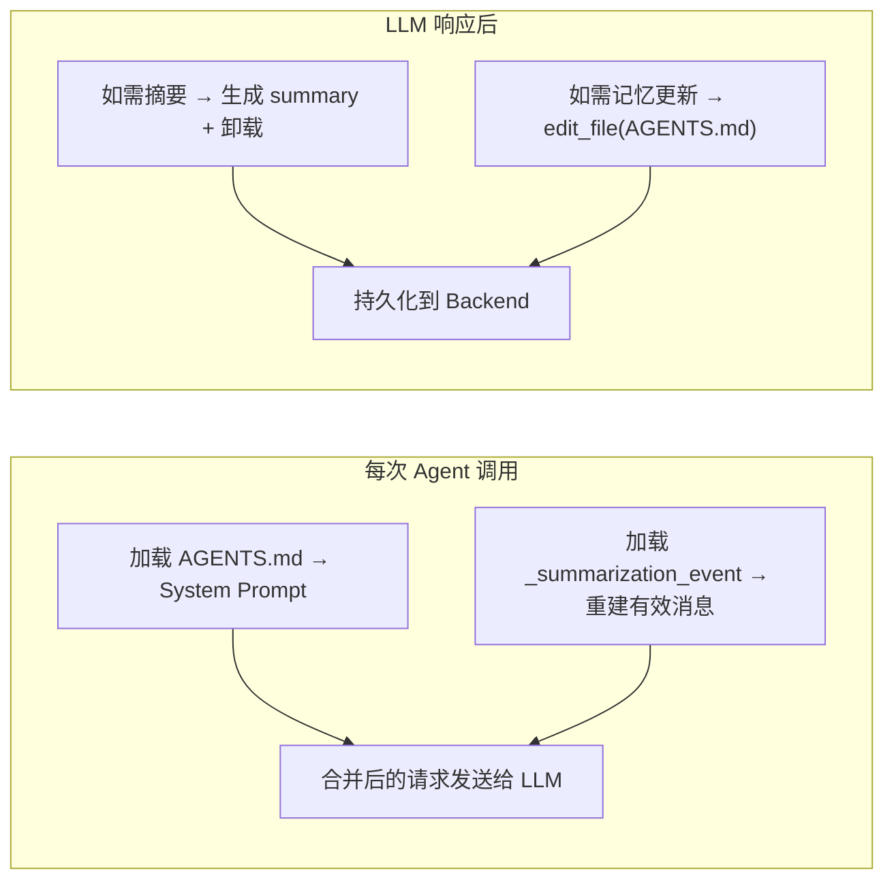

# 长短期记忆模块分析

## 1. 概述

Deep Agents 的记忆系统分为两层：

- **短期记忆（Short-term Memory）**：通过 `SummarizationMiddleware` 管理，体现为 LLM 的对话上下文窗口。当上下文窗口接近容量时，自动将旧消息摘要压缩，释放空间。
- **长期记忆（Long-term Memory）**：通过 `MemoryMiddleware` 管理，从 `AGENTS.md` 文件加载持久化的项目上下文和用户偏好，在每次 Agent 启动时注入到 System Prompt 中。



## 2. 长期记忆：MemoryMiddleware

### 2.1 核心代码

```python
# deepagents/middleware/memory.py

class MemoryMiddleware(AgentMiddleware[MemoryState, ContextT, ResponseT]):
    state_schema = MemoryState

    def __init__(self, *, backend: BACKEND_TYPES, sources: list[str]) -> None:
        self._backend = backend
        self.sources = sources  # 如 ["~/.deepagents/AGENTS.md", "./.deepagents/AGENTS.md"]
```

### 2.2 工作流程



### 2.3 记忆内容注入格式

```xml
<agent_memory>
/path/to/AGENTS.md
(文件内容...)

/path/to/other/AGENTS.md
(文件内容...)
</agent_memory>

<memory_guidelines>
    (何时更新记忆的指导原则...)
</memory_guidelines>
```

### 2.4 记忆更新策略

MemoryMiddleware 通过 System Prompt 中的 `<memory_guidelines>` 指导 LLM **何时**和**如何**更新记忆：

| 场景 | 行为 |
|------|------|
| 用户明确要求记住某事 | 立即 `edit_file` 更新 AGENTS.md |
| 用户给出反馈/偏好 | 捕获原因并编码为模式 |
| 用户中断工具调用并给反馈 | 先更新记忆再修改工具调用 |
| 发现新模式/偏好 | 主动更新 |
| 临时信息 | 不更新（如"我快迟到了"） |
| 一次性任务 | 不更新（如"帮我算25*4"） |
| 凭证/密钥 | **绝不**存储 |

## 3. 短期记忆：SummarizationMiddleware

### 3.1 核心代码

```python
# deepagents/middleware/summarization.py

class SummarizationMiddleware(AgentMiddleware):
    state_schema = SummarizationState

    def wrap_model_call(self, request, handler) -> ModelResponse:
        effective_messages = self._get_effective_messages(request)
        truncated_messages, _ = self._truncate_args(effective_messages, ...)
        total_tokens = self.token_counter(counted_messages)

        if not self._should_summarize(truncated_messages, total_tokens):
            try:
                return handler(request.override(messages=truncated_messages))
            except ContextOverflowError:
                pass  # 回退到摘要路径

        # 执行摘要
        cutoff_index = self._determine_cutoff_index(truncated_messages)
        messages_to_summarize, preserved = self._partition_messages(...)
        file_path = self._offload_to_backend(backend, messages_to_summarize)
        summary = self._create_summary(messages_to_summarize)
        new_messages = self._build_new_messages_with_path(summary, file_path)

        return ExtendedModelResponse(
            model_response=handler(request.override(messages=[*new_messages, *preserved])),
            command=Command(update={"_summarization_event": new_event}),
        )
```

### 3.2 摘要触发与执行流程



### 3.3 触发策略

```python
def compute_summarization_defaults(model: BaseChatModel) -> SummarizationDefaults:
    if has_profile:  # 模型有 max_input_tokens 信息
        return {
            "trigger": ("fraction", 0.85),   # 使用 85% 上下文窗口时触发
            "keep": ("fraction", 0.10),       # 保留最近 10% 的消息
            "truncate_args_settings": {
                "trigger": ("fraction", 0.85),
                "keep": ("fraction", 0.10),
            },
        }
    else:  # 无模型信息，使用保守固定值
        return {
            "trigger": ("tokens", 170000),
            "keep": ("messages", 6),
            ...
        }
```

### 3.4 历史卸载存储格式

卸载的对话历史存储为 Markdown 文件（按线程隔离）：

```
/conversation_history/{thread_id}.md

## Summarized at 2024-01-15T10:30:00Z

Human: 请帮我分析这个项目...
Assistant: 好的，让我先看看项目结构...
Tool: ls / → [结果]
...

## Summarized at 2024-01-15T11:00:00Z

(后续被摘要的消息...)
```

## 4. 长短期记忆协同



| 维度 | 短期记忆 (Summarization) | 长期记忆 (Memory) |
|------|-------------------------|-------------------|
| 存储位置 | Backend `/conversation_history/` | Backend `AGENTS.md` 文件 |
| 生命周期 | 对话线程内 | 跨对话线程持久化 |
| 更新方式 | 自动（token 阈值触发） | LLM 主动通过 `edit_file` |
| 内容类型 | 对话历史摘要 | 项目上下文/用户偏好/工作流 |
| 注入位置 | 替换 messages 列表前部 | 追加到 System Prompt 末尾 |
| 状态键 | `_summarization_event` | `memory_contents` |
