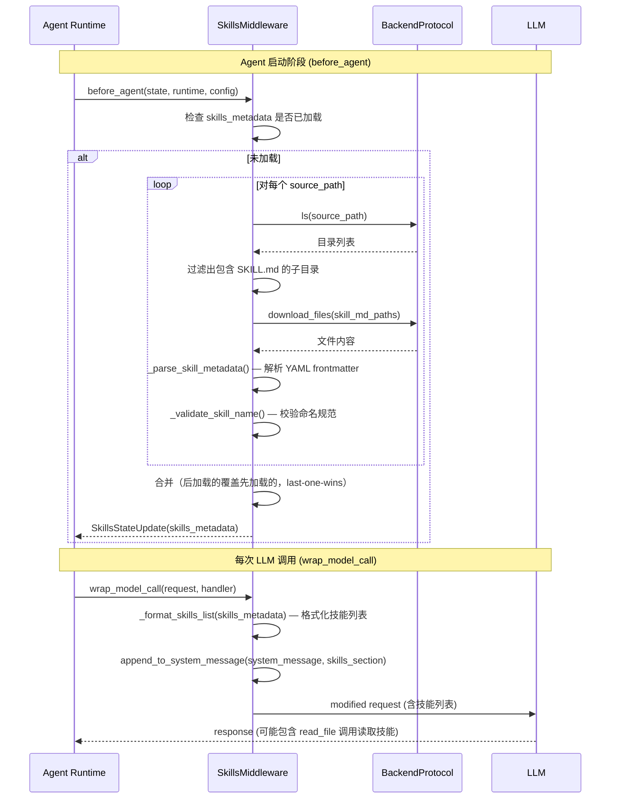
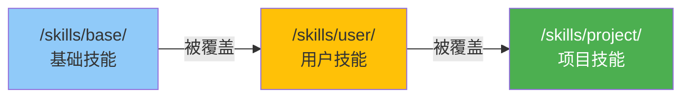

# 技能（Skills）模块分析

## 1. 概述

Skills 系统实现了 Anthropic 的 **渐进式披露（Progressive Disclosure）** 模式：Agent 在 System Prompt 中看到所有可用技能的名称和简短描述，仅在需要时才读取完整的 `SKILL.md` 指令文件。这避免了将所有技能的完整内容塞入上下文窗口。

## 2. 技能结构

```
/skills/user/
├── web-research/
│   ├── SKILL.md          # 必需：YAML frontmatter + Markdown 指令
│   └── helper.py         # 可选：辅助脚本
├── code-review/
│   └── SKILL.md
└── ...

/skills/project/
├── deploy/
│   └── SKILL.md
└── ...
```

**SKILL.md 文件格式：**

```markdown
---
name: web-research
description: Structured approach to conducting thorough web research
license: MIT
compatibility: Python 3.10+
allowed-tools: web_search read_file
---

# Web Research Skill

## When to Use
- User asks you to research a topic
...
```

## 3. 核心代码

```python
# deepagents/middleware/skills.py

class SkillMetadata(TypedDict):
    path: str           # SKILL.md 的路径
    name: str           # 技能名称 (1-64字符, 小写字母+连字符)
    description: str    # 描述 (1-1024字符)
    license: str | None
    compatibility: str | None
    metadata: dict[str, str]
    allowed_tools: list[str]

class SkillsMiddleware(AgentMiddleware[SkillsState, ContextT, ResponseT]):
    state_schema = SkillsState

    def __init__(self, *, backend: BACKEND_TYPES, sources: list[str]) -> None:
        self._backend = backend
        self.sources = sources  # 如 ["/skills/user/", "/skills/project/"]
```

## 4. 技能加载流程



## 5. System Prompt 注入内容

Skills 中间件注入到 System Prompt 中的内容结构：

```markdown
## Skills System

You have access to a skills library...

**User Skills**: `/skills/user/` (higher priority)
**Project Skills**: `/skills/project/`

**Available Skills:**

- **web-research**: Structured approach to conducting thorough web research (License: MIT)
  -> Allowed tools: web_search, read_file
  -> Read `/skills/user/web-research/SKILL.md` for full instructions
- **code-review**: ... 
  -> Read `/skills/project/code-review/SKILL.md` for full instructions

**How to Use Skills (Progressive Disclosure):**
1. Recognize when a skill applies
2. Read the skill's full instructions using the path shown
3. Follow the skill's instructions
4. Access supporting files using absolute paths
```

## 6. 技能源优先级



技能加载按 sources 列表顺序进行，**后加载的同名技能覆盖先加载的**（last-one-wins）。这实现了分层覆盖：

```python
# graph.py 中的使用
if skills is not None:
    gp_middleware.append(SkillsMiddleware(backend=backend, sources=skills))
```

## 7. 名称校验规则

```python
def _validate_skill_name(name: str, directory_name: str) -> tuple[bool, str]:
    # 约束：
    # - 1-64 字符
    # - 只允许小写字母、数字、连字符
    # - 不能以连字符开头或结尾
    # - 不能有连续双连字符
    # - 必须与 SKILL.md 所在目录名一致
```

| 校验规则 | 示例 | 结果 |
|---------|------|------|
| 小写字母+数字+连字符 | `web-research` | 通过 |
| 大写字母 | `Web-Research` | 警告 |
| 以连字符开头 | `-research` | 警告 |
| 连续连字符 | `web--research` | 警告 |
| 名称不匹配目录名 | name=`foo` in `/skills/bar/SKILL.md` | 警告 |
| 超过 64 字符 | (长名称) | 警告 |

> 注：校验不通过仅产生**警告**，不影响加载（向后兼容）。

## 8. 与其他模块的关系

| 关联模块 | 交互方式 |
|---------|---------|
| FilesystemMiddleware | LLM 通过 `read_file` 工具读取完整 SKILL.md |
| MemoryMiddleware | 技能和记忆都通过 `before_agent` + `wrap_model_call` 注入 System Prompt |
| SubAgentMiddleware | 子代理可独立配置 `skills` 参数 |
| BackendProtocol | 通过 Backend 的 `ls`/`download_files` 加载技能文件 |
