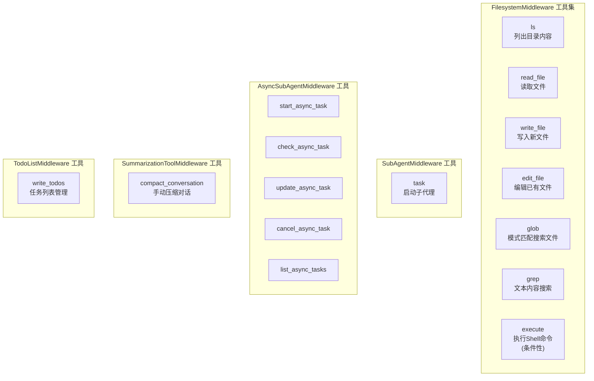
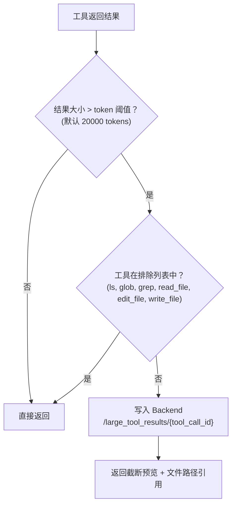
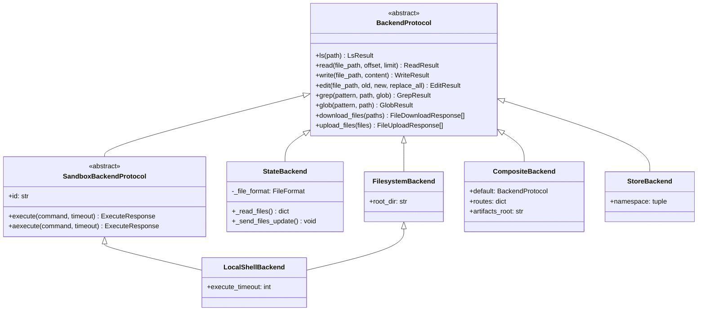

# 工具（Tools）模块分析

## 1. 概述

Deep Agents 的工具系统通过 `FilesystemMiddleware` 提供核心工具集，并通过 `SummarizationToolMiddleware` 提供对话压缩工具。所有工具均基于 Backend 抽象层实现，确保存储后端的可插拔性。

## 2. 工具全景



## 3. FilesystemMiddleware — 核心文件系统工具

### 3.1 工具创建机制

每个工具通过 `_create_*_tool()` 方法构建，同时提供同步和异步实现：

```python
# deepagents/middleware/filesystem.py

class FilesystemMiddleware(AgentMiddleware[FilesystemState, ContextT, ResponseT]):
    def __init__(self, *, backend=None, ...):
        self.tools = [
            self._create_ls_tool(),
            self._create_read_file_tool(),
            self._create_write_file_tool(),
            self._create_edit_file_tool(),
            self._create_glob_tool(),
            self._create_grep_tool(),
            self._create_execute_tool(),  # 仅当 Backend 支持执行时可用
        ]

    def _create_ls_tool(self) -> BaseTool:
        def sync_ls(runtime: ToolRuntime, path: str) -> str:
            backend = self._get_backend(runtime)
            ls_result = backend.ls(validated_path)
            return str(result)

        async def async_ls(runtime: ToolRuntime, path: str) -> str:
            backend = self._get_backend(runtime)
            ls_result = await backend.als(validated_path)
            return str(result)

        return StructuredTool.from_function(
            name="ls", func=sync_ls, coroutine=async_ls, args_schema=LsSchema,
        )
```

### 3.2 工具详细说明

#### ls — 列出目录

```python
class LsSchema(BaseModel):
    path: str  # 绝对路径
```

- 返回目录中的文件和子目录列表
- 结果过大时自动截断

#### read_file — 读取文件

```python
class ReadFileSchema(BaseModel):
    file_path: str     # 绝对路径
    offset: int = 0    # 起始行号 (0-indexed)
    limit: int = 100   # 最大行数
```

- 支持分页读取大文件
- 返回带行号的内容（cat -n 格式）
- 支持多模态文件（图片、PDF 等返回 base64 编码）
- 超长行自动拆分为续行（如 `5.1`, `5.2`）
- 超大内容自动截断并提示使用 `execute('jq . file')` 等格式化

#### write_file — 写入新文件

```python
class WriteFileSchema(BaseModel):
    file_path: str
    content: str
```

- 仅创建新文件，已存在时报错
- 建议优先使用 `edit_file`

#### edit_file — 编辑文件

```python
class EditFileSchema(BaseModel):
    file_path: str
    old_string: str    # 要替换的精确文本
    new_string: str    # 替换文本
    replace_all: bool = False  # 是否全局替换
```

- 要求先 `read_file` 后才能编辑
- `replace_all=False` 时 `old_string` 必须在文件中唯一

#### glob — 模式匹配

```python
class GlobSchema(BaseModel):
    pattern: str       # 如 "**/*.py", "*.txt"
    path: str = "/"    # 搜索根目录
```

- 20 秒超时保护
- 结果过大时截断

#### grep — 文本搜索

```python
class GrepSchema(BaseModel):
    pattern: str                          # 字面文本（非正则）
    path: str | None = None
    glob: str | None = None               # 文件过滤
    output_mode: Literal[...] = "files_with_matches"
```

- 支持三种输出模式：文件列表 / 匹配内容 / 匹配计数

#### execute — Shell 命令执行（条件性）

```python
class ExecuteSchema(BaseModel):
    command: str
    timeout: int | None = None
```

- **仅当 Backend 实现 `SandboxBackendProtocol` 时可用**
- 运行时检查，不支持时返回错误提示
- 最大超时 3600 秒（1 小时）
- 返回 stdout/stderr 合并输出 + exit code

### 3.3 大结果自动卸载

FilesystemMiddleware 自动检测工具返回结果的大小，超过 token 阈值时将结果写入文件系统，返回截断预览：



## 4. Backend 抽象层

所有工具通过 `BackendProtocol` 统一接口访问存储：



### Backend 选型指南

| Backend | 存储 | 执行 | 适用场景 |
|---------|------|------|---------|
| `StateBackend` | 内存（LangGraph 状态） | 无 | 无状态对话、测试 |
| `FilesystemBackend` | 本地文件系统 | 无 | CLI 工具、本地开发 |
| `LocalShellBackend` | 本地文件系统 | 本地 Shell | CLI 工具（需执行命令） |
| `StoreBackend` | LangGraph Store（持久化） | 无 | 跨线程持久化存储 |
| `CompositeBackend` | 按路径路由 | 取决于 default | 混合存储策略 |
| `SandboxBackend` 子类 | 沙箱文件系统 | 沙箱 Shell | Docker/远程执行环境 |

## 5. 工具与 System Prompt 的协同

FilesystemMiddleware 通过 `wrap_model_call()` 在 System Prompt 中注入工具使用指南：

```python
FILESYSTEM_SYSTEM_PROMPT = """## Filesystem Tools

- ls: list files in a directory
- read_file: read a file from the filesystem
- write_file: write to a file
- edit_file: edit a file
- glob: find files matching a pattern
- grep: search for text within files
"""

EXECUTION_SYSTEM_PROMPT = """## Execute Tool

You have access to an `execute` tool for running shell commands...
"""
```

执行工具的 System Prompt 仅在 Backend 支持执行时注入：

```python
def wrap_model_call(self, request, handler):
    tools = list(request.tools) if request.tools else []
    backend = self._get_backend_from_state(request.state)
    if _supports_execution(backend):
        tools.extend(self._execution_tools)
        # 注入 EXECUTION_SYSTEM_PROMPT
    else:
        tools.extend(self._non_execution_tools)
    return handler(request.override(tools=tools, ...))
```
