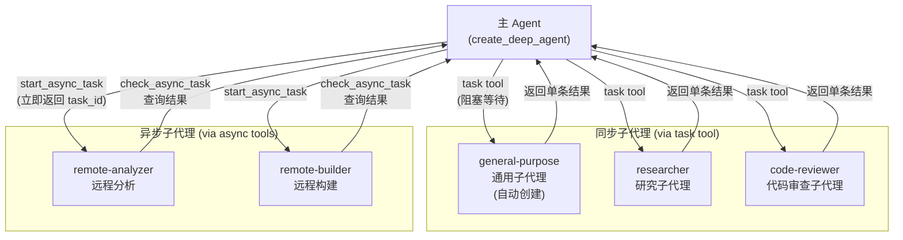
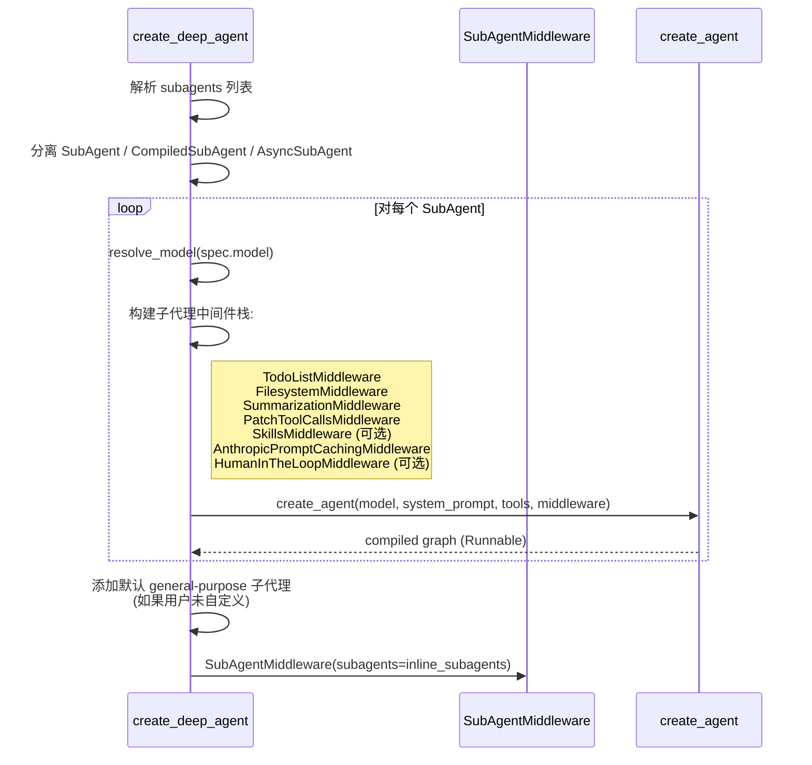
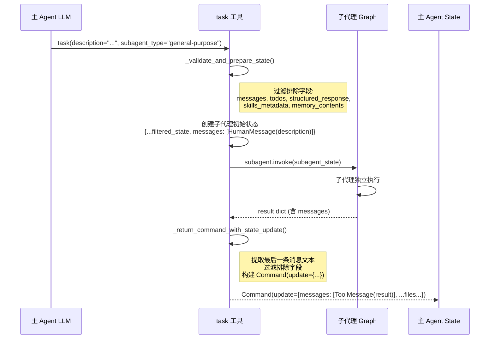
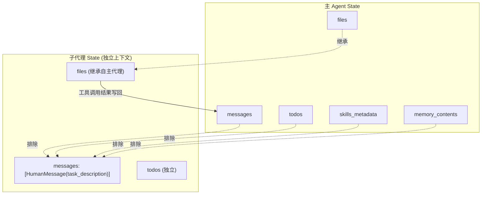
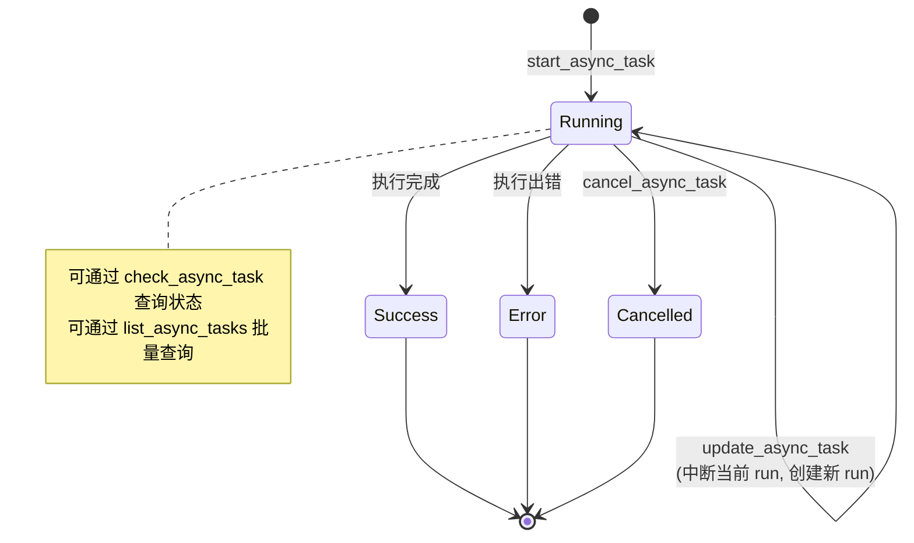
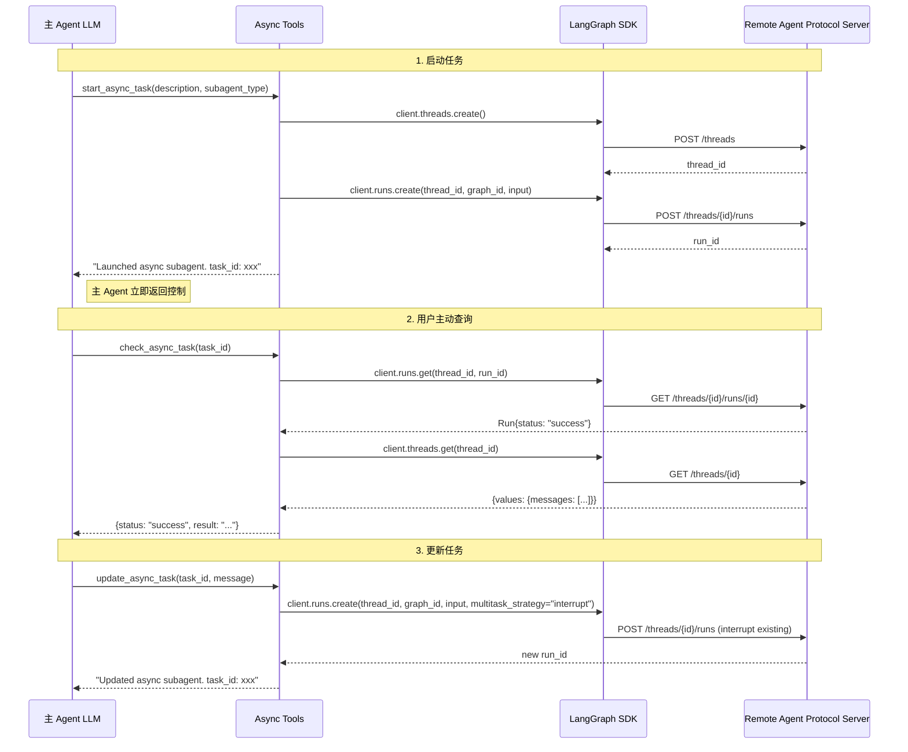

# 多 Agent 协作模块分析

## 1. 概述

Deep Agents 支持三种类型的子代理协作：

| 类型 | 中间件 | 执行方式 | 适用场景 |
|------|--------|---------|---------|
| **同步子代理 (SubAgent)** | `SubAgentMiddleware` | 阻塞式，在当前进程内运行 | 独立的复杂任务，需要上下文隔离 |
| **预编译子代理 (CompiledSubAgent)** | `SubAgentMiddleware` | 阻塞式，使用预构建的 Runnable | 自定义图结构，非标准 Agent |
| **异步子代理 (AsyncSubAgent)** | `AsyncSubAgentMiddleware` | 非阻塞式，远程 Agent Protocol 服务器 | 长时间运行，远程部署 |

## 2. 总体架构



## 3. 同步子代理 — SubAgentMiddleware

### 3.1 子代理规格定义

```python
class SubAgent(TypedDict):
    name: str           # 唯一标识
    description: str    # 描述（用于主 Agent 决策何时委派）
    system_prompt: str  # 子代理的系统提示
    tools: NotRequired[...]    # 工具集（默认继承主 Agent）
    model: NotRequired[...]    # 模型（默认继承主 Agent）
    middleware: NotRequired[...] # 中间件
    interrupt_on: NotRequired[...] # 人机交互配置
    skills: NotRequired[...]   # 技能路径
```

### 3.2 子代理构建流程



### 3.3 task 工具调用流程



### 3.4 子代理默认中间件栈

```python
# graph.py 中构建子代理中间件
subagent_middleware = [
    TodoListMiddleware(),
    FilesystemMiddleware(backend=backend),
    create_summarization_middleware(subagent_model, backend),
    PatchToolCallsMiddleware(),
]
if subagent_skills:
    subagent_middleware.append(SkillsMiddleware(backend=backend, sources=subagent_skills))
subagent_middleware.extend(spec.get("middleware", []))
subagent_middleware.append(AnthropicPromptCachingMiddleware(unsupported_model_behavior="ignore"))
```

### 3.5 状态隔离与共享



**排除字段：** `_EXCLUDED_STATE_KEYS = {"messages", "todos", "structured_response", "skills_metadata", "memory_contents"}`

## 4. 异步子代理 — AsyncSubAgentMiddleware

### 4.1 异步子代理规格

```python
class AsyncSubAgent(TypedDict):
    name: str           # 唯一标识
    description: str    # 描述
    graph_id: str       # 远程服务器上的 Graph 名称
    url: NotRequired[str]      # Agent Protocol 服务器 URL
    headers: NotRequired[dict] # 请求头
```

### 4.2 异步子代理生命周期



### 4.3 异步工具集交互流程



### 4.4 异步任务状态追踪

```python
class AsyncTask(TypedDict):
    task_id: str          # 等同于 thread_id
    agent_name: str       # 子代理类型名称
    thread_id: str        # 远程线程 ID
    run_id: str           # 当前执行 ID
    status: str           # running / success / error / cancelled
    created_at: str       # ISO-8601
    last_checked_at: str  # 上次查询时间
    last_updated_at: str  # 上次状态变更时间
```

任务信息持久化在 Agent State 的 `async_tasks` 字段中，使用自定义 reducer 合并：

```python
def _tasks_reducer(existing, update):
    merged = dict(existing or {})
    merged.update(update)
    return merged
```

## 5. 子代理配置示例

```python
from deepagents import create_deep_agent

agent = create_deep_agent(
    model="anthropic:claude-sonnet-4-6",
    tools=[my_custom_tool],
    subagents=[
        # 同步子代理 — 自动构建
        {
            "name": "researcher",
            "description": "Deep research agent for complex topics",
            "system_prompt": "You are a research specialist...",
            "tools": [search_tool, read_tool],
        },
        # 预编译子代理 — 使用自定义图
        {
            "name": "custom-processor",
            "description": "Custom processing pipeline",
            "runnable": my_custom_graph,
        },
        # 异步子代理 — 远程部署
        {
            "name": "remote-builder",
            "description": "Remote build service",
            "graph_id": "build_agent",
            "url": "https://my-deployment.langsmith.dev",
        },
    ],
)
```
