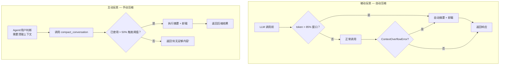
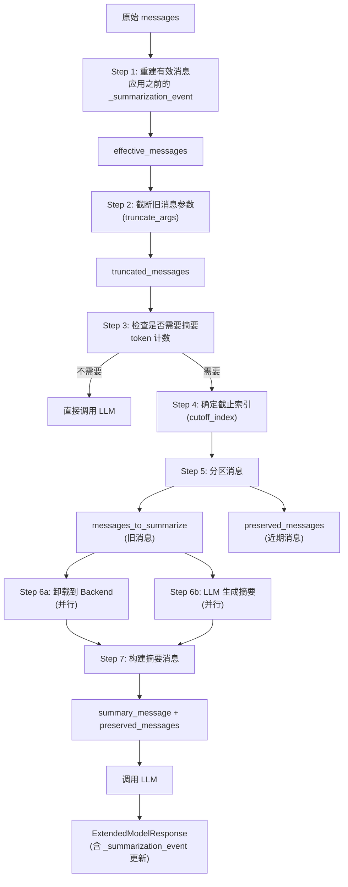
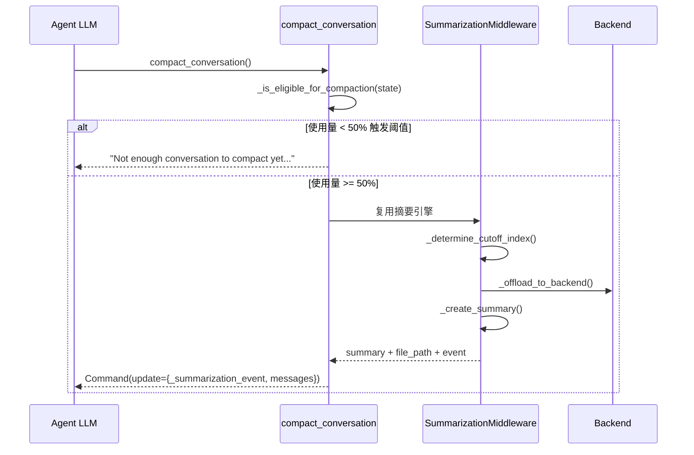
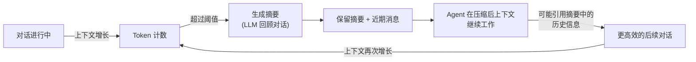

# 反思与摘要（Reflection / Summarization）模块分析

## 1. 概述

Deep Agents 的"反思"机制主要体现在 `SummarizationMiddleware` 的对话摘要与压缩能力。它不是一个显式的"反思-修正"循环，而是一种**隐式反思**——当上下文窗口接近容量时，系统自动对历史对话进行回顾、提炼和压缩，保留关键信息的同时释放上下文空间。

此外，`SummarizationToolMiddleware` 提供了 `compact_conversation` 工具，允许 Agent（或用户）主动触发压缩，实现"自我反思"。

## 2. 两种反思模式



## 3. 摘要流程详解

### 3.1 消息处理管线



### 3.2 参数截断（truncate_args）

在完整摘要之前，先进行轻量级的参数截断——将旧消息中 `write_file` 和 `edit_file` 工具调用的巨大参数值截短：

```python
def _truncate_tool_call(self, tool_call: dict) -> dict:
    args = tool_call.get("args", {})
    truncated_args = {}
    for key, value in args.items():
        if isinstance(value, str) and len(value) > self._max_arg_length:
            truncated_args[key] = value[:20] + self._truncation_text
        else:
            truncated_args[key] = value
    return {**tool_call, "args": truncated_args}
```

**截断策略：**
- 仅处理 `write_file` 和 `edit_file` 工具调用
- 仅截断超过 `max_length`（默认 2000 字符）的参数
- 保留前 20 个字符 + 截断标记 `"...(argument truncated)"`
- 不截断近期消息（keep 窗口内的消息保持完整）

### 3.3 摘要事件（SummarizationEvent）

每次摘要操作产生一个事件，记录在 Agent State 中：

```python
class SummarizationEvent(TypedDict):
    cutoff_index: int              # 消息列表中的截止位置
    summary_message: HumanMessage  # 摘要内容（以 HumanMessage 形式注入）
    file_path: str | None          # 卸载历史的文件路径
```

**状态链式处理：** 当连续发生多次摘要时，通过 `_summarization_event` 重建有效消息：

```python
@staticmethod
def _apply_event_to_messages(messages, event):
    if event is None:
        return list(messages)
    summary_msg = event["summary_message"]
    cutoff_idx = event["cutoff_index"]
    return [summary_msg] + messages[cutoff_idx:]
```

### 3.4 卸载存储

摘要前的原始消息被卸载到 Backend，以 Markdown 格式存储：

```
/conversation_history/{thread_id}.md

## Summarized at 2024-01-15T10:30:00Z

Human: ...
Assistant: ...
Tool (ls): ...

## Summarized at 2024-01-15T11:00:00Z
...
```

**关键细节：**
- 每个线程一个文件
- 多次摘要追加到同一文件（不覆盖）
- 过滤掉之前的摘要消息（避免冗余存储）
- 卸载失败不影响摘要流程（file_path=None 时摘要仍继续）

### 3.5 摘要消息格式

```python
# 有文件路径时
content = f"""You are in the middle of a conversation that has been summarized.

The full conversation history has been saved to {file_path} should you need to refer back to it.

A condensed summary follows:

<summary>
{summary}
</summary>"""

# 无文件路径时
content = f"Here is a summary of the conversation to date:\n\n{summary}"
```

## 4. 主动压缩 — compact_conversation 工具

```python
class SummarizationToolMiddleware(AgentMiddleware):
    state_schema = SummarizationState

    def __init__(self, summarization: SummarizationMiddleware):
        self._summarization = summarization
        self.tools = [self._create_compact_tool()]
```

**使用门槛：** 需要已使用约 50% 的自动摘要触发阈值，避免过早压缩。



## 5. 触发策略详解

```python
# 有模型 profile 时的默认值
{
    "trigger": ("fraction", 0.85),     # 85% 上下文窗口
    "keep": ("fraction", 0.10),        # 保留最近 10%
    "truncate_args_settings": {
        "trigger": ("fraction", 0.85), # 同上
        "keep": ("fraction", 0.10),
    },
}

# 无模型 profile 时的保守默认值
{
    "trigger": ("tokens", 170000),
    "keep": ("messages", 6),
    "truncate_args_settings": {
        "trigger": ("messages", 20),
        "keep": ("messages", 20),
    },
}
```

**触发类型（ContextSize）：**

| 类型 | 示例 | 含义 |
|------|------|------|
| `("fraction", 0.85)` | 使用 85% 的模型上下文窗口 | 适用于有 profile 的模型 |
| `("tokens", 170000)` | token 数达到 170000 | 适用于无 profile 的模型 |
| `("messages", 50)` | 消息数达到 50 条 | 固定消息数阈值 |

## 6. 与 LLM 的反思闭环



这种设计确保了 Agent 在长时间任务中不会因上下文溢出而崩溃，同时通过摘要保留了历史对话的关键信息，形成了一种持续的"隐式反思"循环。
