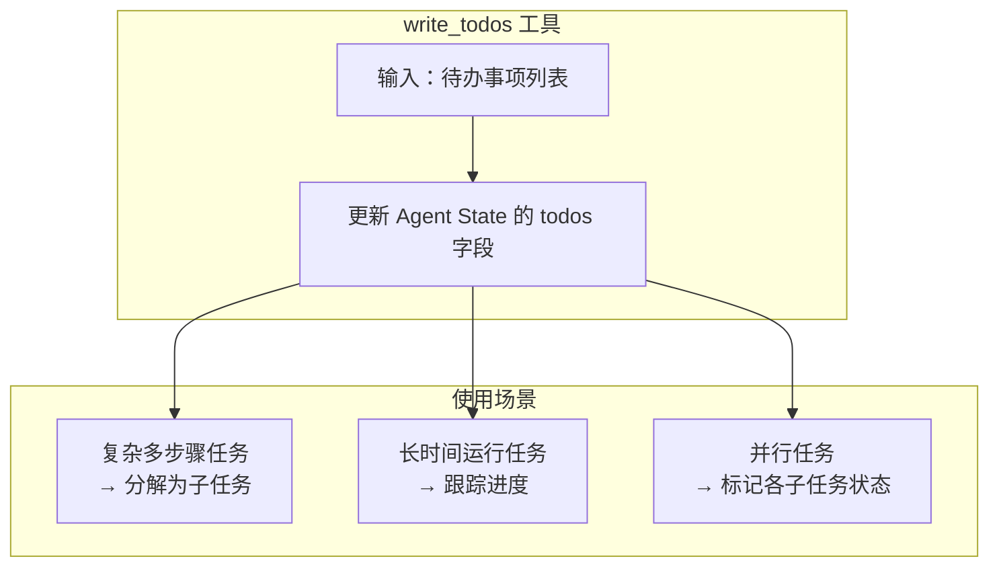
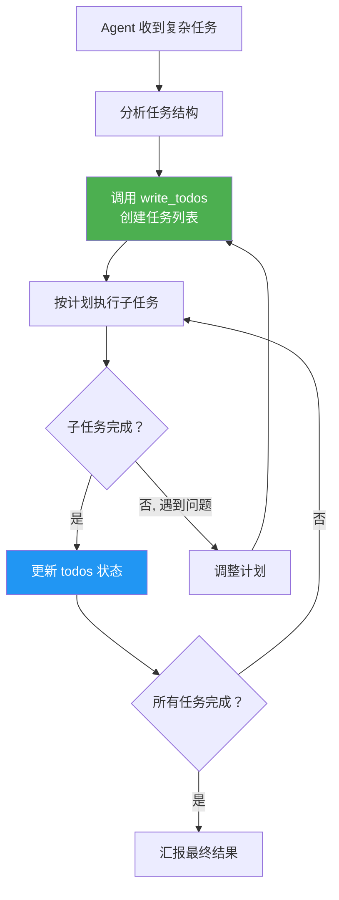
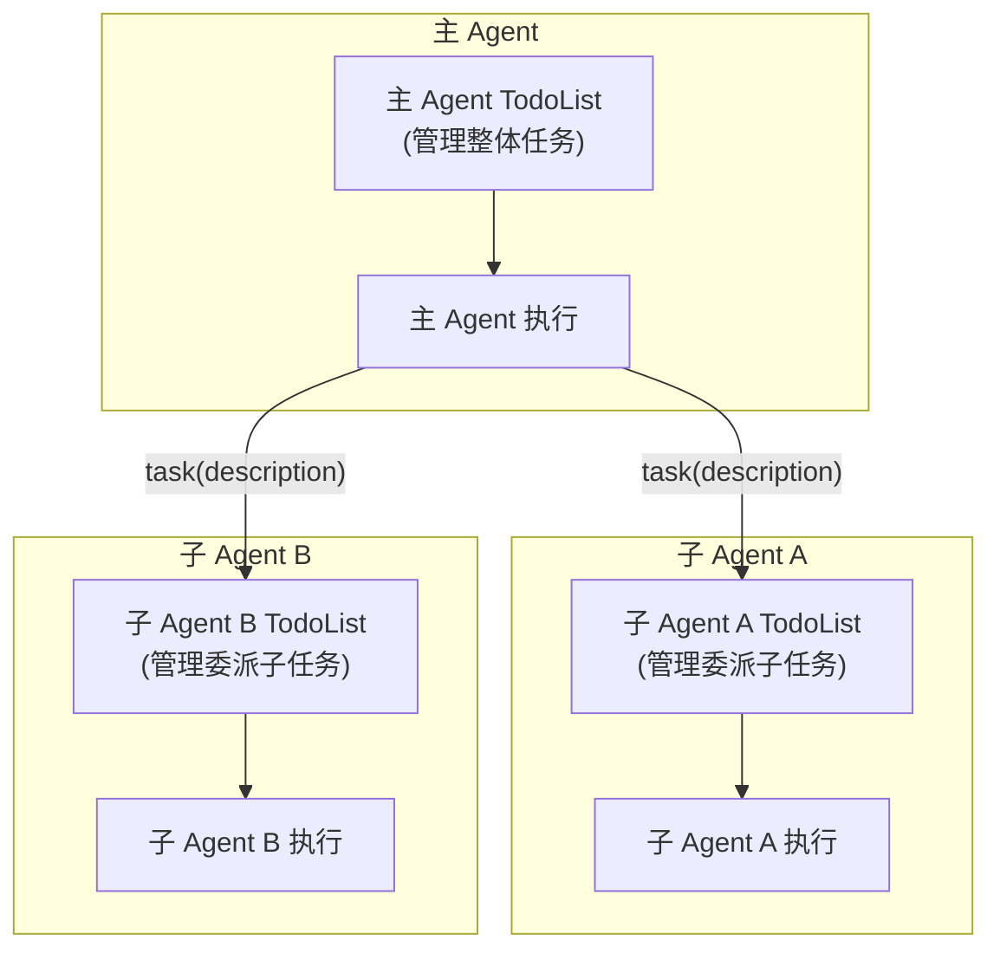

# 计划（Plan / TodoList）模块分析

## 1. 概述

Deep Agents 的计划能力通过 LangChain 的 `TodoListMiddleware` 实现。该中间件在 Agent 的中间件栈中处于最顶层（第一个被添加），为 Agent 提供 `write_todos` 工具，用于管理任务列表。

> 注：`TodoListMiddleware` 定义在 `langchain.agents.middleware` 中，不是 Deep Agents SDK 的一部分。Deep Agents 在 `create_deep_agent()` 中将其作为基础中间件注入。

## 2. 在中间件栈中的位置

```python
# graph.py 中的中间件构建
deepagent_middleware = [
    TodoListMiddleware(),                    # ← 第一层：任务管理
    SkillsMiddleware(...),                   # 第二层：技能加载（可选）
    FilesystemMiddleware(backend=backend),   # 第三层：文件系统工具
    SubAgentMiddleware(...),                 # 第四层：子代理
    create_summarization_middleware(...),    # 第五层：摘要压缩
    PatchToolCallsMiddleware(),              # 第六层：工具调用修复
    AsyncSubAgentMiddleware(...),            # 第七层：异步子代理（可选）
    # ... 用户自定义中间件 ...
    AnthropicPromptCachingMiddleware(...),   # 提示缓存
    MemoryMiddleware(...),                   # 长期记忆（可选）
    HumanInTheLoopMiddleware(...),           # 人机交互（可选）
]
```

## 3. TodoList 的工作方式

### 3.1 工具说明

`write_todos` 工具允许 Agent 创建、更新和管理待办事项列表：



### 3.2 任务管理流程



## 4. 在主代理和子代理中的双重应用

`TodoListMiddleware` 同时被添加到**主代理**和**子代理**的中间件栈中：

```python
# 主代理中间件
deepagent_middleware = [
    TodoListMiddleware(),  # 主代理级别的任务管理
    ...
]

# 子代理中间件
gp_middleware = [
    TodoListMiddleware(),  # 每个子代理也有独立的任务管理
    FilesystemMiddleware(backend=backend),
    ...
]
```



## 5. 与其他模块的协作

| 关联模块 | 协作方式 |
|---------|---------|
| SubAgentMiddleware | 主 Agent 可将 TodoList 中的任务委派给子代理 |
| SummarizationMiddleware | 摘要时 `todos` 字段被排除（不传播到子代理） |
| FilesystemMiddleware | 子任务可能涉及文件操作 |
| HumanInTheLoopMiddleware | 用户可在任务执行过程中介入审批 |

## 6. 计划能力的局限性

- `TodoListMiddleware` 由 LangChain 提供，Deep Agents 不做扩展
- `todos` 状态不跨对话线程持久化（除非使用 Checkpointer）
- 子代理的 `todos` 不会回传给主代理（在 `_EXCLUDED_STATE_KEYS` 中）
- 没有内置的"计划验证"或"计划修正"机制——完全依赖 LLM 的判断
