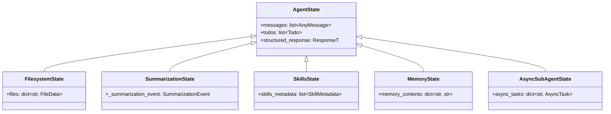
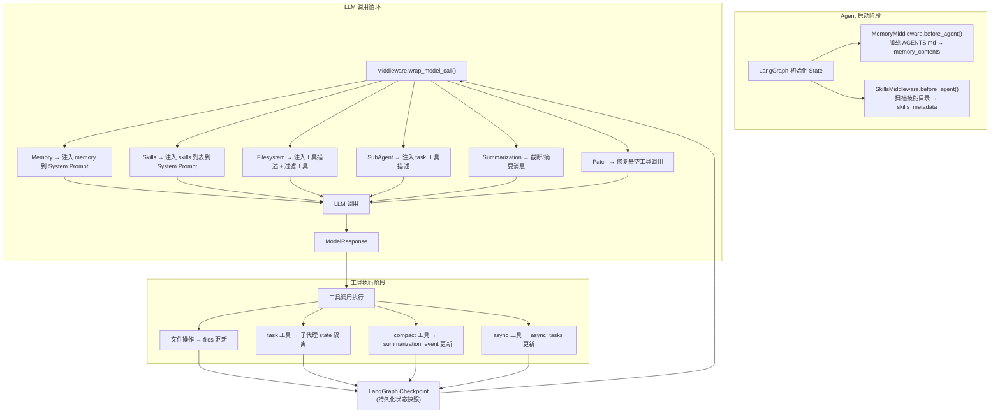
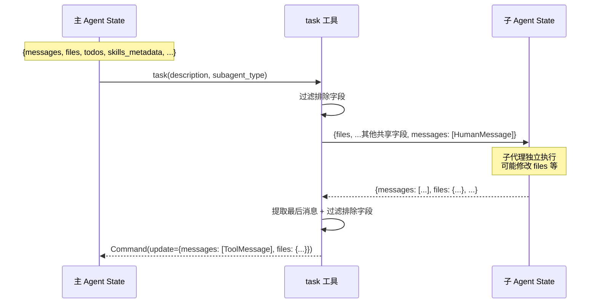
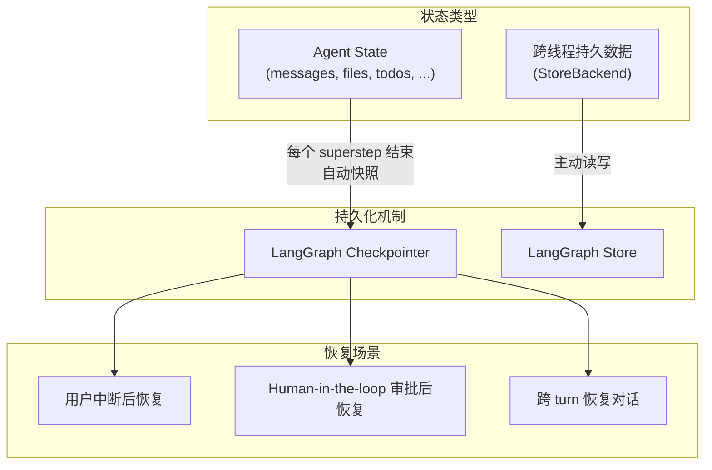
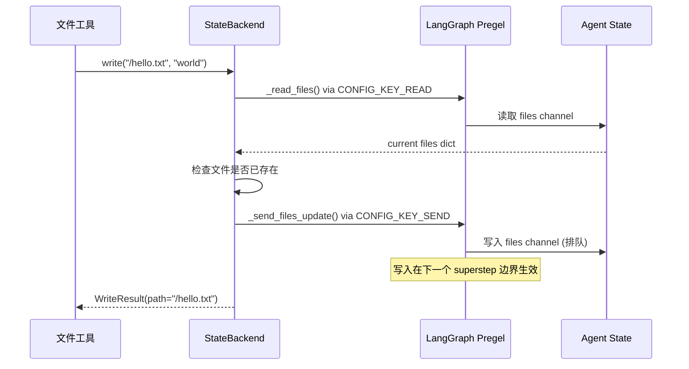

# 状态流转与管理分析

## 1. 概述

Deep Agents 的状态管理建立在 LangGraph 的 StateGraph 之上。每个中间件通过 `state_schema` 扩展全局状态，LangGraph 的 reducer 机制确保状态更新的正确合并。状态流转贯穿 Agent 的整个生命周期。

## 2. 全局状态结构



### 状态字段分类

| 字段 | 中间件 | Reducer | 传播性 |
|------|--------|---------|--------|
| `messages` | LangGraph 内置 | 消息追加 | 跨节点传播 |
| `files` | FilesystemMiddleware | `_file_data_reducer`（支持删除） | 跨节点传播 |
| `todos` | TodoListMiddleware | 覆盖 | 跨节点传播 |
| `_summarization_event` | SummarizationMiddleware | 覆盖（PrivateStateAttr） | 不传播到父代理 |
| `skills_metadata` | SkillsMiddleware | 覆盖（PrivateStateAttr） | 不传播到父代理 |
| `memory_contents` | MemoryMiddleware | 覆盖（PrivateStateAttr） | 不传播到父代理 |
| `async_tasks` | AsyncSubAgentMiddleware | `_tasks_reducer`（合并） | 跨节点传播 |

## 3. 状态流转全景



## 4. 关键 Reducer 机制

### 4.1 files 字段 — 支持删除的字典合并

```python
def _file_data_reducer(left, right):
    """合并文件更新，支持通过 None 值删除"""
    if left is None:
        return {k: v for k, v in right.items() if v is not None}
    result = {**left}
    for key, value in right.items():
        if value is None:
            result.pop(key, None)  # None 表示删除
        else:
            result[key] = value     # 覆盖/新增
    return result
```

```mermaid
graph LR
    subgraph "现有 files"
        A["/file1.txt: 'hello'"]
        B["/file2.txt: 'world'"]
    end

    subgraph "更新"
        C["/file2.txt: None (删除)"]
        D["/file3.txt: 'new'"]
    end

    subgraph "合并结果"
        E["/file1.txt: 'hello'"]
        F["/file3.txt: 'new'"]
    end

    A --> E
    B -->|"被删除"| X[""]
    C --> X
    D --> F
```

### 4.2 async_tasks 字段 — 任务合并

```python
def _tasks_reducer(existing, update):
    merged = dict(existing or {})
    merged.update(update)
    return merged
```

### 4.3 PrivateStateAttr — 私有字段

使用 `PrivateStateAttr` 注解的字段**不会传播到父代理**：

```python
class SkillsState(AgentState):
    skills_metadata: NotRequired[Annotated[list[SkillMetadata], PrivateStateAttr]]

class MemoryState(AgentState):
    memory_contents: NotRequired[Annotated[dict[str, str], PrivateStateAttr]]
```

## 5. 子代理间的状态流转

### 5.1 主代理 → 子代理（调用时）

```python
# 过滤排除字段
_EXCLUDED_STATE_KEYS = {
    "messages", "todos", "structured_response",
    "skills_metadata", "memory_contents"
}

subagent_state = {
    k: v for k, v in runtime.state.items()
    if k not in _EXCLUDED_STATE_KEYS
}
subagent_state["messages"] = [HumanMessage(content=description)]
```

### 5.2 子代理 → 主代理（返回时）

```python
def _return_command_with_state_update(result, tool_call_id):
    # 仅保留非排除字段 + 最后一条消息
    state_update = {
        k: v for k, v in result.items()
        if k not in _EXCLUDED_STATE_KEYS
    }
    message_text = result["messages"][-1].text.rstrip()
    return Command(update={
        **state_update,
        "messages": [ToolMessage(message_text, tool_call_id=tool_call_id)],
    })
```



## 6. 状态持久化



**Checkpointer** 保存每个 superstep 结束时的完整状态快照，支持：
- 对话中断后恢复
- Human-in-the-loop 审批后继续
- 时间旅行调试

## 7. Backend 层的状态读写

StateBackend 通过 LangGraph 的内部机制直接读写状态：

```python
class StateBackend(BackendProtocol):
    def _read_files(self) -> dict[str, Any]:
        config = self._get_config()
        read = config["configurable"][CONFIG_KEY_READ]
        return read("files", fresh=False) or {}

    def _send_files_update(self, update: dict[str, Any]) -> None:
        config = self._get_config()
        send = config["configurable"][CONFIG_KEY_SEND]
        send([("files", update)])
```


