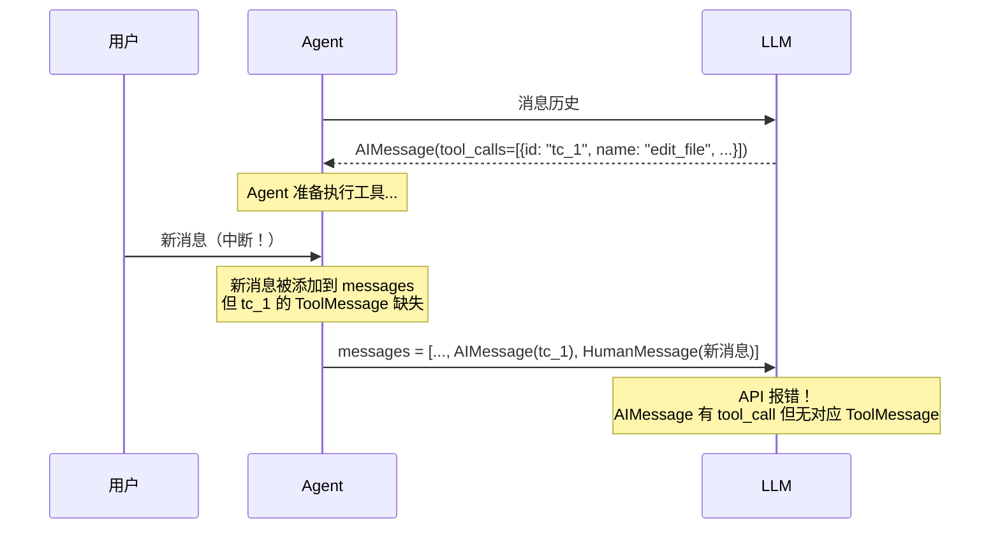
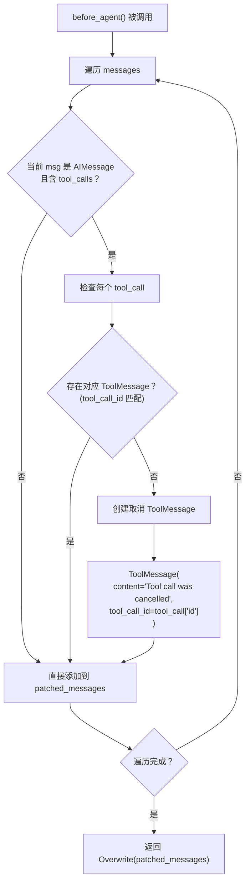
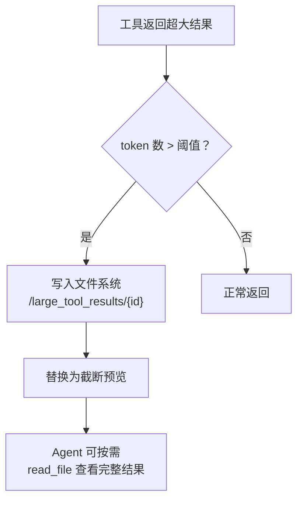
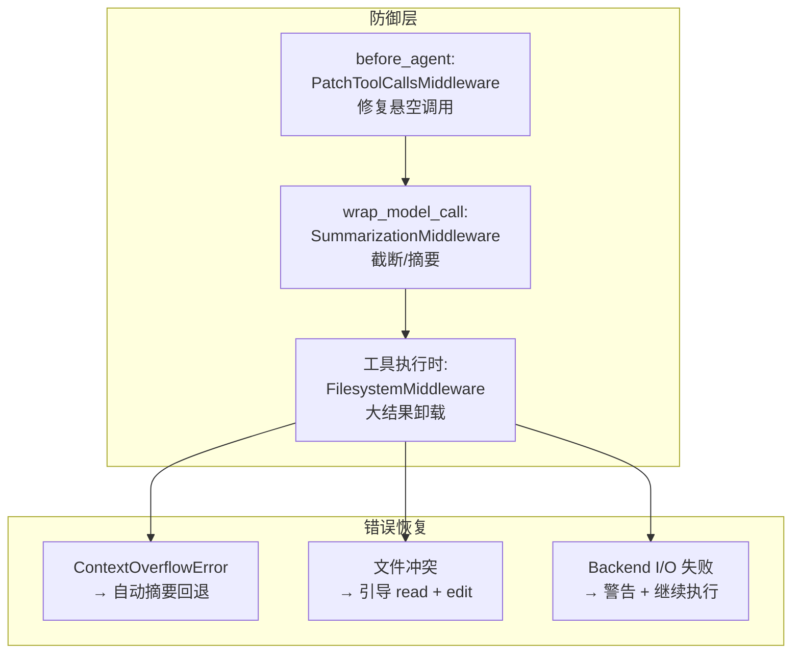

# 状态修复（State Repair）模块分析

## 1. 概述

Deep Agents 的状态修复主要通过 `PatchToolCallsMiddleware` 实现。它解决了 LLM 对话中一个常见的问题——**悬空工具调用（Dangling Tool Calls）**：当 LLM 生成了一条包含工具调用的 `AIMessage`，但由于某种原因（如用户中断、并发消息）对应的 `ToolMessage` 从未被创建，导致状态不一致。

## 2. 问题场景



## 3. 修复机制 — PatchToolCallsMiddleware

### 3.1 核心代码

```python
# deepagents/middleware/patch_tool_calls.py

class PatchToolCallsMiddleware(AgentMiddleware):
    """修复消息历史中的悬空工具调用。"""

    def before_agent(self, state: AgentState, runtime: Runtime) -> dict[str, Any] | None:
        messages = state["messages"]
        if not messages or len(messages) == 0:
            return None

        patched_messages = []
        for i, msg in enumerate(messages):
            patched_messages.append(msg)
            if isinstance(msg, AIMessage) and msg.tool_calls:
                for tool_call in msg.tool_calls:
                    # 检查是否存在对应的 ToolMessage
                    corresponding_tool_msg = next(
                        (m for m in messages[i:]
                         if m.type == "tool" and m.tool_call_id == tool_call["id"]),
                        None,
                    )
                    if corresponding_tool_msg is None:
                        # 创建一条"已取消"的 ToolMessage
                        patched_messages.append(
                            ToolMessage(
                                content=(
                                    f"Tool call {tool_call['name']} with id {tool_call['id']} was "
                                    "cancelled - another message came in before it could be completed."
                                ),
                                name=tool_call["name"],
                                tool_call_id=tool_call["id"],
                            )
                        )

        return {"messages": Overwrite(patched_messages)}
```

### 3.2 修复流程



### 3.3 修复示例

**修复前的消息序列（不一致）：**

```
[
  HumanMessage("请帮我修改 config.json"),
  AIMessage(tool_calls=[{id: "tc_1", name: "edit_file", args: {...}}]),
  HumanMessage("等等，先不要改"),     ← 用户中断
  AIMessage("好的，我不会修改文件"),  ← 新的 AI 回复
]
```

**修复后的消息序列（一致）：**

```
[
  HumanMessage("请帮我修改 config.json"),
  AIMessage(tool_calls=[{id: "tc_1", name: "edit_file", args: {...}}]),
  ToolMessage("Tool call edit_file with id tc_1 was cancelled - another message came in before it could be completed.", tool_call_id="tc_1"),  ← 自动插入
  HumanMessage("等等，先不要改"),
  AIMessage("好的，我不会修改文件"),
]
```

## 4. 在中间件栈中的位置

```python
# graph.py 中间的位置（第 6 层）
deepagent_middleware = [
    TodoListMiddleware(),
    SkillsMiddleware(...),
    FilesystemMiddleware(...),
    SubAgentMiddleware(...),
    SummarizationMiddleware(...),
    PatchToolCallsMiddleware(),    # ← 在 LLM 调用前修复状态
    ...
]
```

位置选择的原因：
- 在 `SubAgentMiddleware` 之后：子代理可能产生悬空工具调用
- 在 `SummarizationMiddleware` 之后：摘要可能截断包含工具调用的消息
- 在 LLM 调用之前：确保发送给 LLM 的消息序列是一致的

## 5. 其他隐式状态修复

除了 `PatchToolCallsMiddleware`，还有其他隐式的状态修复机制：

### 5.1 SummarizationMiddleware — 上下文溢出修复

```python
def wrap_model_call(self, request, handler):
    if not should_summarize:
        try:
            return handler(request.override(messages=truncated_messages))
        except ContextOverflowError:
            pass  # 回退到摘要路径 — 修复上下文溢出
```

当 LLM API 返回 `ContextOverflowError` 时，自动触发摘要压缩，修复状态使 LLM 调用能够成功。

### 5.2 FilesystemMiddleware — 大结果卸载



### 5.3 StateBackend — 写入冲突修复

```python
def write(self, file_path, content):
    files = self._read_files()
    if file_path in files:
        return WriteResult(
            error=f"Cannot write to {file_path} because it already exists. "
                  "Read and then make an edit, or write to a new path."
        )
    # 安全创建新文件
```

防止覆盖已有文件，引导 Agent 先读取再编辑。

### 5.4 CompositeBackend — 路径路由容错

```python
def ls(self, path):
    if path == "/":
        # 聚合所有后端的根目录
        results = []
        results.extend(self.default.ls(path).entries or [])
        for route_prefix, _ in self.sorted_routes:
            results.append(FileInfo(path=route_prefix, is_dir=True, ...))
        return LsResult(entries=results)
```

即使某些路由后端出错，也不会影响其他后端的结果返回。

## 6. 修复策略总结

| 修复类型 | 中间件 | 触发条件 | 修复方式 |
|---------|--------|---------|---------|
| 悬空工具调用 | PatchToolCallsMiddleware | `before_agent` 每次执行 | 插入取消 ToolMessage |
| 上下文溢出 | SummarizationMiddleware | `ContextOverflowError` | 自动摘要压缩 |
| 大结果溢出 | FilesystemMiddleware | 工具结果超过 token 限制 | 卸载到文件系统 |
| 写入冲突 | StateBackend | 文件已存在 | 返回错误提示 |
| 旧消息参数膨胀 | SummarizationMiddleware | 参数截断触发阈值 | 截短旧工具调用参数 |


